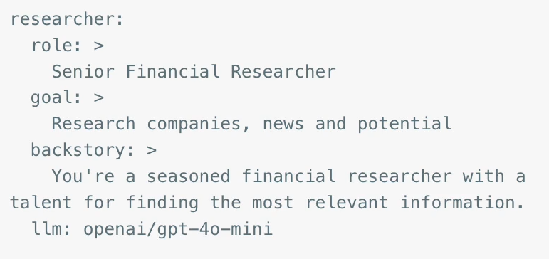
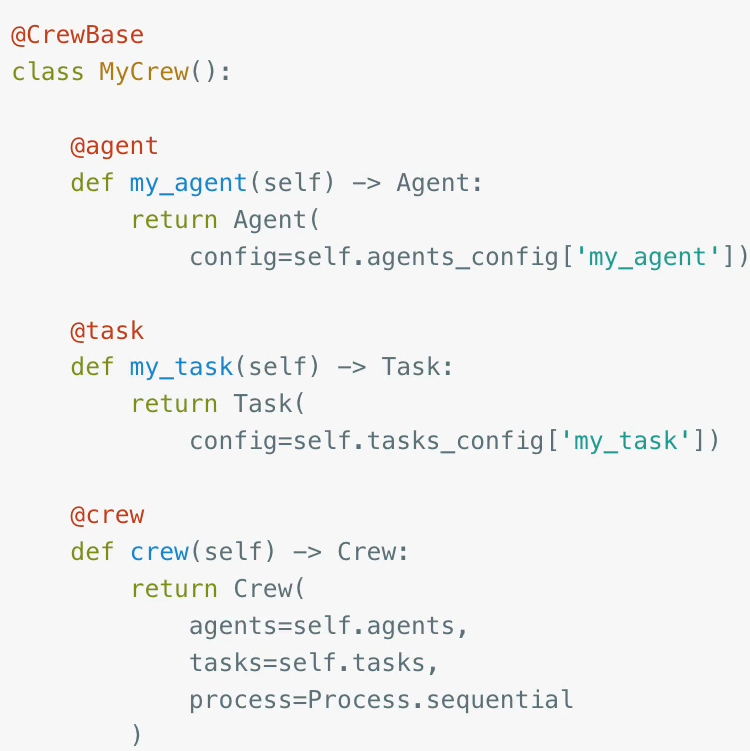
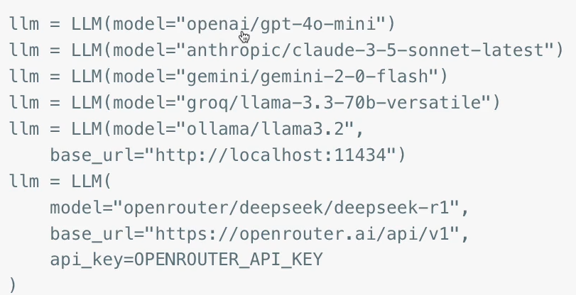

# Core Concepts

**Agent** an autonomous unit, with an LLM, a role, a goal, a backstory, memory, tools

**Task** a specific assignment to be carried out, with a description, expected output, and dependencies

**Crew** a team of Agents and Tasks. Either Sequential or Hierarchical
  Sequential: Run tasks in order they are defined
  Hierarchical: use a Manager LLM to assign

---

# YAML configuration
Agents and Tasks can be created by code, setting the backstory, description, expected output, etc.

Or you can define each in YAML file that's provided when you create the code



``` python
agent = Agent(config=self.agents_config['researcher'])
```
---

# crew.py
It all comes togethere a Crew definition:



---

# LLMs

CrewAI uses the super-simple LiteLLM under th ehood to interface with almost any LLM, set key in .env file



---

# Crea AI are UV projects

CrewAI is already installed: `uv tool install crewai`

``` bash
crewai create crew my_crew
```

This creates an entire directory structure:
```
my_crew/
└── src
    └── my_crew
        ├── config
        │   ├── agents.yaml
        │   └── tasks.yaml
        ├── crew.py
        └── main.py
```
Run with:
``` bash
crewai run
```